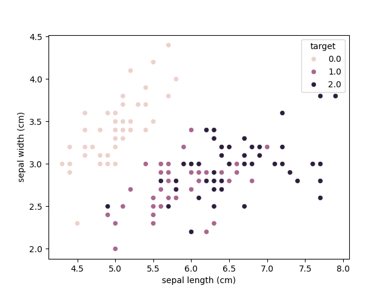
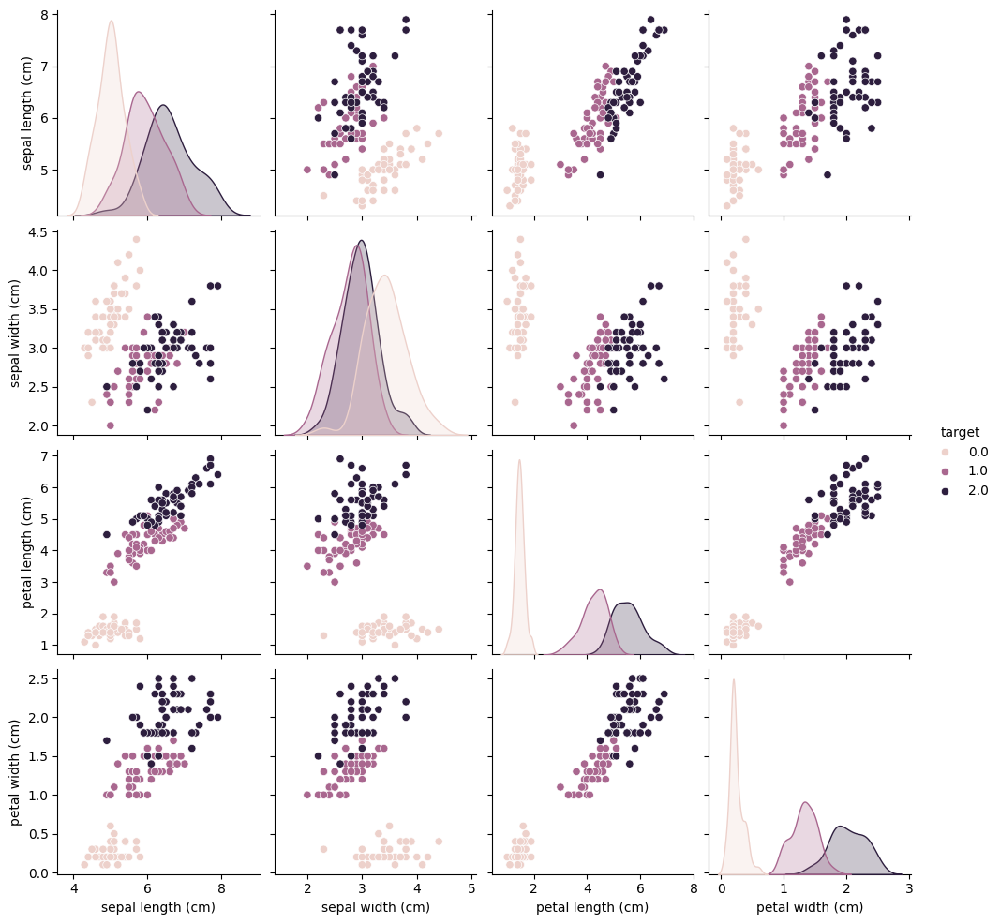
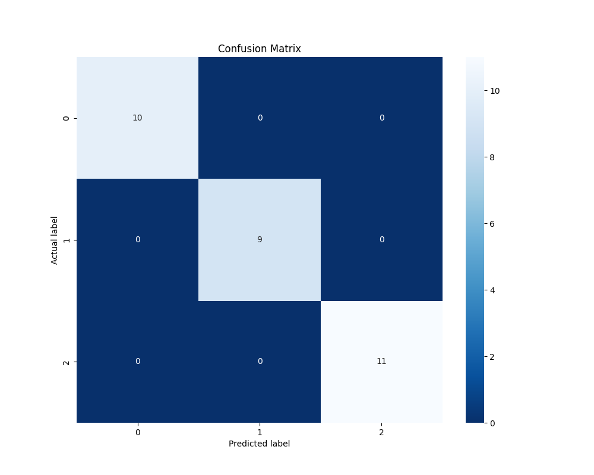
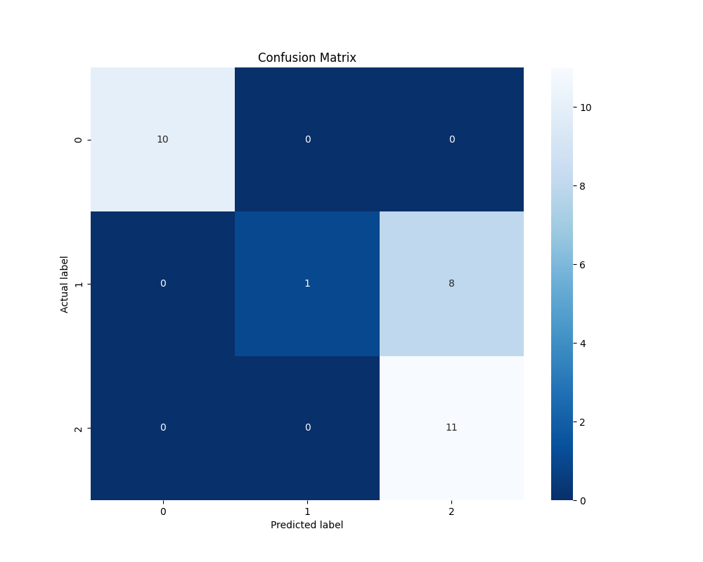

# 机器学习中多分类问题中的数值方法
---
## 创建 python 虚拟环境

### 1. Windows 安装 Anaconda3

- 使用该[链接](https://www.anaconda.com/download/#windows)下载 Anaconda3 Win64 版本。
- 双击安装程序启动。
- 点击下一步。
- 阅读许可条款并单击“我同意”。
- 除非您要为所有用户安装（需要 Windows 管理员权限），否则请选择“仅我自己”安装，然后单击“下一步”。
- 选择要安装 Anaconda 的目标文件夹，然后单击下一步按钮。
> Notices: 将 Anaconda 安装到不包含空格或 unicode 字符(中文)的目录路径。除非需要管理员权限，否则不要以管理员身份安装。

- 选择是否将 Anaconda 添加到您的 PATH 环境变量。我们建议不要将 Anaconda 添加到 PATH 环境变量中，因为这会干扰其他软件。相反，通过从开始菜单打开 Anaconda Navigator 或 Anaconda Prompt 来使用 Anaconda 软件。

- 选择是否将 Anaconda 注册为默认 Python。除非您计划安装和运行多个版本的 Anaconda 或多个版本的 Python，否则请接受默认设置并选中此框。

- 单击安装按钮。如果您想查看 Anaconda 正在安装的软件包，请单击“显示详细信息”。

- 单击下一步按钮。

- 安装成功后，您将看到“感谢安装 Anaconda”对话框。

### 2. 下载项目

- Option1: 直接下载 `.zip` 并解压

- Option2: Clone 项目
`git clone git@github.com:SimonHanYANG/lris_MachineLearning_Classification.git`

### 3. 创建虚拟环境

- 打开电脑 CMD/命令行，进入项目目录
```bash
# 进入目标盘 (windows)
cd e:

# 进入项目文件夹
cd lris_MachineLearning_Classification
```

- 查看 conda 命令是否安装成功，并检查电脑目前的虚拟环境
```bash
conda env list
```

- 创建 python=3.9+ 的名为 lris 的虚拟环境
```bash
conda create -n lris python=3.9
```

- 进入虚拟环境
```bash
conda activate lris
```

- 安装依赖
```bash
pip install -r requirements.txt -i https://pypi.mirrors.ustc.edu.cn/simple
```
---
## 项目文件描述

- `data_visualization.py`: 数据可视化代码

- `dataset.py`: Load lris 数据代码

- `others*.py`: 各种方法运行代码

---
## 数据可视化

### 1. Scatter Plot


### 2. Pair Plot


---
## Results

### 1. Logic Regression



### 2. KNN


### 3. MLP



### 4. Naive Bayes


### 5. Random Forest


### 6. SVM

